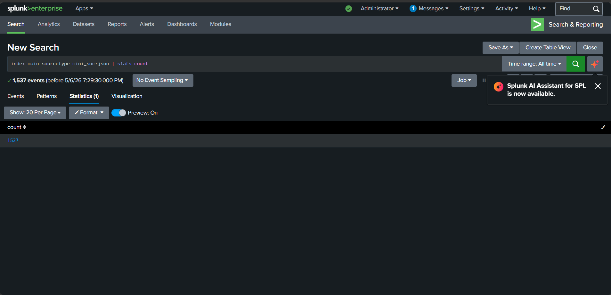
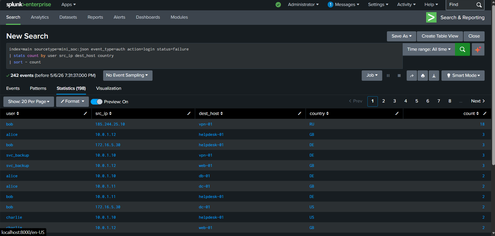
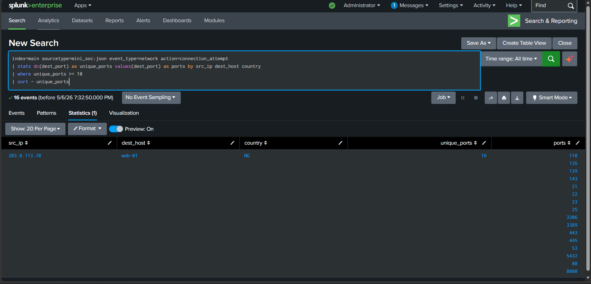
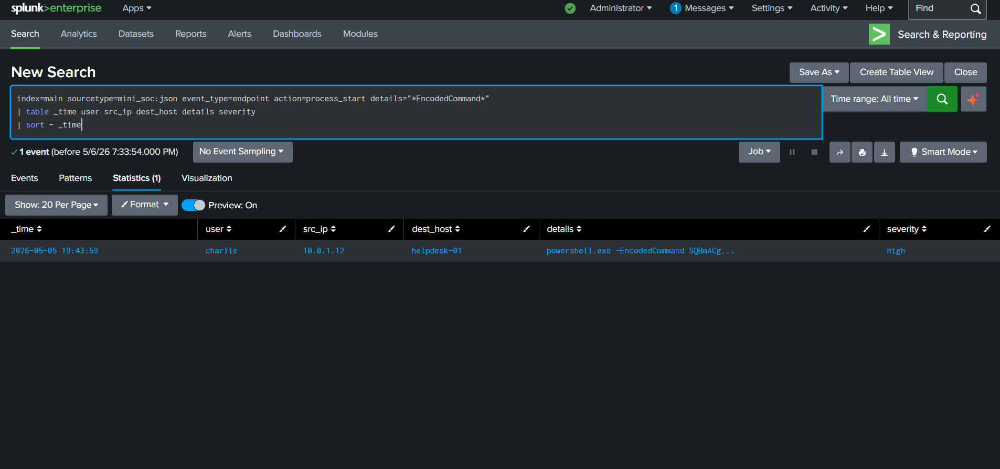
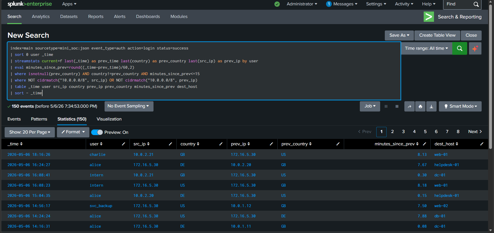
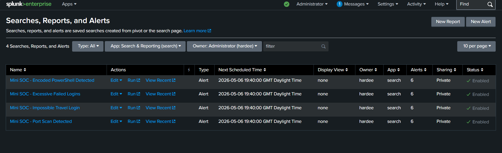
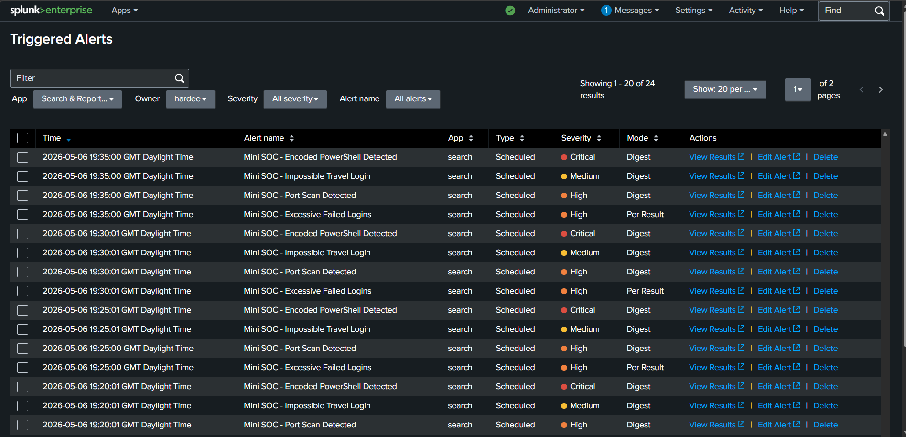

# Mini SOC Lab (Splunk SIEM)

End-to-end SOC project demonstrating detection engineering, alerting, and incident reporting in Splunk using simulated attack telemetry.

## Why This Project Matters
This lab shows practical SOC analyst workflow skills that map directly to entry-level cybersecurity roles:
- Log ingestion and normalization in SIEM
- Detection logic design using SPL
- Alert tuning and scheduling
- Automated triage workflow design using SOAR-style decision logic
- Incident triage and communication

## Environment
- Platform: Windows
- SIEM: Splunk Enterprise
- Data format: JSONL (`mini_soc:json` sourcetype)
- Events generated: `1537`

## Attack Scenarios Simulated
1. Brute-force login behavior with follow-on success pattern
2. Port-scan reconnaissance across multiple destination ports
3. Encoded PowerShell execution on endpoint
4. Impossible-travel style authentication anomalies

## Detection Queries (SPL)
Detection rules are stored in [splunk/detections.spl](./splunk/detections.spl).

Configured alert set:
- `Mini SOC - Excessive Failed Logins`
- `Mini SOC - Port Scan Detected`
- `Mini SOC - Encoded PowerShell Detected`
- `Mini SOC - Impossible Travel Login`

## Key Findings
- Identified concentrated failed login attempts against `bob` from `185.244.25.10` targeting `vpn-01` (RU), consistent with brute-force activity.
- Identified port-scan behavior from `203.0.113.70` against `web-01` with `16` unique destination ports.
- Detected encoded PowerShell execution (`-EncodedCommand`) by `charlie` on `helpdesk-01`, a high-signal suspicious execution indicator.
- Detected rapid country-switch authentication patterns requiring credential misuse validation and account verification.

## Incident Reporting
Full analyst report is included in [report/incident_report.md](./report/incident_report.md), covering:
- What happened
- How it was detected
- What it means
- Recommended SOC response actions

## Automated Triage (SOAR Simulation)
The lab now includes a SOAR-style triage pipeline in [soar/](./soar/) that processes Splunk alert payloads after detection. It enriches the source IP with mock VirusTotal-style reputation, decides whether to escalate or auto-close, writes escalated ticket JSON files, and prints a mock Slack notification for analyst handoff.

This simulates a real workflow such as:

```text
Splunk alert -> SOAR webhook -> IP reputation -> condition -> ticket/Slack
```

## Repository Structure
- `data/security_events.jsonl` - Simulated attack and background events
- `scripts/generate_fake_attacks.py` - Attack event generator
- `scripts/run_lab.ps1` - Quick run helper
- `soar/triage_pipeline.py` - SOAR-style alert enrichment and triage script
- `soar/README.md` - SOAR workflow mapping and run guide
- `splunk/detections.spl` - Detection searches
- `splunk/alerts_setup.md` - Alert setup guide
- `splunk/inputs.conf` - File monitor input example
- `report/incident_report.md` - Incident findings report
- `screenshots/` - Evidence images from Splunk

## Evidence (Screenshots)
Add these files to `screenshots/` and they will render in this README:
- `01-ingestion-count.png`
- `02-failed-logins-detection.png`
- `03-port-scan-detection.png`
- `04-encoded-powershell-detection.png`
- `05-impossible-travel-detection.png`
- `06-alerts-list.png`
- `07-triggered-alerts.png`









## How To Reproduce
1. Generate data:
   ```powershell
   python .\scripts\generate_fake_attacks.py --output .\data\security_events.jsonl --seed 42 --days 2
   ```
2. Ingest in Splunk as sourcetype `mini_soc:json`.
3. Run detections from `splunk/detections.spl`.
4. Save detections as scheduled alerts and validate triggers.

## Summary
Built a Mini SOC Lab in Splunk by generating synthetic attack telemetry, ingesting and parsing SIEM logs, engineering SPL detections, creating scheduled alerts, and producing analyst-grade incident documentation.
